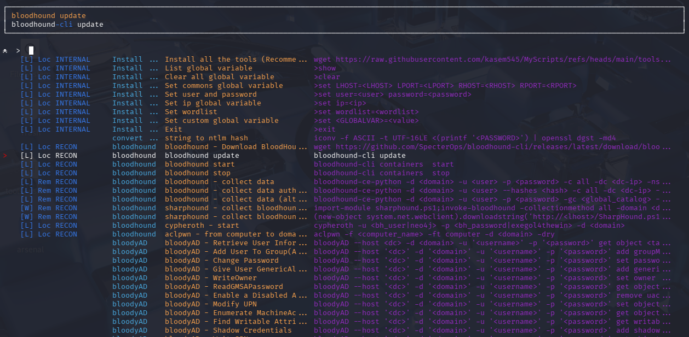

# Arsenal


Arsenal is just a quick inventory, reminder and launcher for pentest commands.
<br>This project written by pentesters for pentesters simplify the use of all the hard-to-remember commands


In arsenal you can search for a command, select one and it's prefilled directly in your terminal. This functionality is independent of the shell used. Indeed arsenal emulates real user input (with TTY arguments and IOCTL) so arsenal works with all shells and your commands will be in the history.

You have to enter arguments if needed, but arsenal supports global variables. <br>
For example, during a pentest we can set the variable `ip` to prefill all commands using an ip with the right one.

To do that you just have to enter the following command in arsenal:
```
>set ip=10.10.10.10
``` 

Authors: 
* Guillaume Muh
* mayfly

This project is inspired by navi (<https://github.com/denisidoro/navi>) because the original version was in bash and too hard to understand to add features


## Arsenal new features



- New colors
- Add tmux new pane support (with -t)
- Add default values in cheatsheets commands with `<argument|default_value>`
- Support description inside cheatsheets
- New categories and Tags
- New cheatsheets
- Add yml support (thx @0xswitch )
- Add fzf support with ctrl+t (thx @mgp25)
- Add prefix to commands generated (with -f)

## Install & Launch
- with pipx :
```
pipx install git+https://github.com/kasem545/arsenal@dev
```

- run (we also advice you to add this alias : `alias a='arsenal'`)
```
arsenal
```

- manually:
```
git clone --branch dev https://github.com/kasem545/arsenal.git
cd arsenal
python3 -m pip install -r requirements.txt
./run
```

Inside your .bashrc or .zshrc add the path to `run` to help you do that you could launch the addalias.sh script
```
./addalias.sh
```

## Launch in tmux mode

```
./run -t # if you launch arsenal in a tmux window with one pane, it will split the window and send the command to the otherpane without quitting arsenal
         # if the window is already split the command will be send to the other pane without quitting arsenal
./run -t -e # just like the -t mode but with direct execution in the other pane without quitting arsenal
```

## Add external cheatsheets

You could add your own cheatsheets inside the my_cheats folder or in the ~/.cheats folder.

You could also add additional paths to the file `<arsenal_home>/arsenal/modules/config.py`,
arsenal reads `.md` (MarkDown) and `.rst` (RestructuredText).

```
CHEATS_PATHS = [
    join(BASEPATH, "cheats"), # DEFAULT
    join(HOMEPATH, "docs/my_cheats")
]
```

Cheatsheets examples are in `<arsenal_home>/cheats`: `README.md` and `README.rst`

## Add a prefix commands generated

In order to prefix commands generated by arsenal you need to set the `arsenal_prefix_cmd` global variable. 

For example if you need your commands to be prefixed with `proxychains -q`:
```
>set arsenal_prefix_cmd=proxychains -q
```

then you can start run arsenal with the prefix option:
```bash
arsenal -f
```

## Troubleshooting

If you got on error on color init try : 
```
export TERM='xterm-256color'
```

--

If you have the following exception when running Arsenal:
```
ImportError: cannot import name 'FullLoader'
```
First, check that requirements are installed:
```
pip install -r requirements.txt
```
If the exception is still there:
```
pip install -U PyYAML
```

--

If you encounter an exception similar to the following (contains TIOCSTI in strace) when running Arsenal:
```
[...]
    fcntl.ioctl(stdin, termios.TIOCSTI, c)
OSError: [Errno 5] Input/output error
```
Then you may need to re-enable TIOCSTI. Please run the following commands as root to fix this issue on the current session :
```
sysctl -w dev.tty.legacy_tiocsti=1
```
If you want this workaround to survive a reboot, add the following configuration to sysctl.conf file and reboot :
```
echo "dev.tty.legacy_tiocsti=1" >> /etc/sysctl.conf
```
More information is available in the issue [https://github.com/Orange-Cyberdefense/arsenal/issues/77](https://github.com/Orange-Cyberdefense/arsenal/issues/77)


## Mindmap
- Active directory mindmap
  - Due to csp on github when you open the svg, we moved the AD mindmap and the source to this repository : [https://github.com/Orange-Cyberdefense/ocd-mindmaps](https://github.com/Orange-Cyberdefense/ocd-mindmaps)

[https://orange-cyberdefense.github.io/ocd-mindmaps/img/pentest_ad_dark_2022_11.svg](https://orange-cyberdefense.github.io/ocd-mindmaps/img/pentest_ad_dark_2022_11.svg)

- AD mindmap black version


- Exchange Mindmap (thx to @snovvcrash)


- Active directory ACE mindmap

